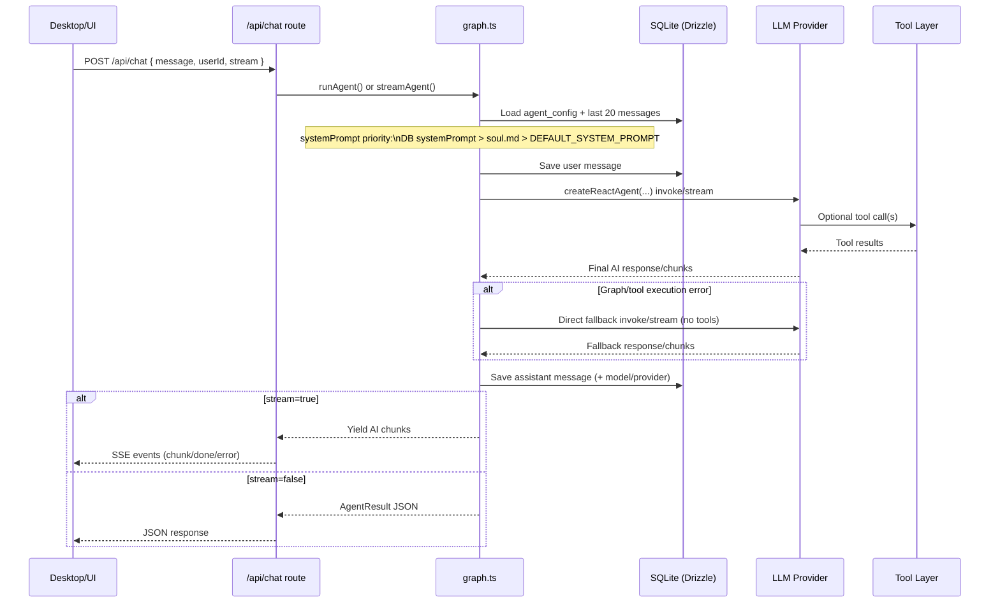

# AI Graph Architecture

This document explains how ANIMA processes a chat request in `apps/api/src/agent/graph.ts`.

## Flow Diagram

## Entry Points
- HTTP route: `POST /api/chat` in `apps/api/src/routes/chat.ts`
- Non-streaming mode calls `runAgent(message, userId)`.
- Streaming mode calls `streamAgent(message, userId)` and returns SSE chunks.

## Runtime Configuration
For each request, the graph loads user config from `agent_config`:
- `provider` (`ollama`, `openai`, `anthropic`, `openrouter`)
- `model`
- optional `apiKey`, `ollamaUrl`, `systemPrompt`

If user config does not exist, defaults are:
- provider: `ollama`
- model: `qwen3:14b`
- ollama URL: `http://localhost:11434`

## Persona / System Prompt Resolution
Prompt priority is:
1. Per-user `systemPrompt` from DB (Settings page)
2. `soul.md` loaded at startup
3. Built-in `DEFAULT_SYSTEM_PROMPT`

`soul.md` lookup order:
- `ANIMA_SOUL_PATH` (if set)
- `<cwd>/soul.md`
- `<cwd>/../../soul.md` (covers running from `apps/api`)

## Graph Construction
`buildAgent(config, userId, systemPrompt?)` builds a LangGraph ReAct agent:
- LLM from `createModel(config)` in `apps/api/src/agent/models.ts`
- Toolset from `createTools(userId)` in `apps/api/src/agent/tools.langchain.ts`
- System message via `messageModifier`

`createReactAgent(...)` drives the reason-act loop internally:
- model decides when to call tools
- tool outputs are fed back into the loop
- final assistant message is produced

## Message Lifecycle
1. Load last 20 messages from `messages` table.
2. Save incoming user message immediately.
3. Invoke graph with history + new user message.
4. Extract final AI message.
5. Save assistant response with `model` + `provider` metadata.

## Streaming Path
`streamAgent` uses `agent.stream(..., { streamMode: "messages" })` and only emits:
- AI text chunks
- from `langgraph_node === "agent"`

Tool-call chatter is not sent to the client.

## Failure Behavior
If graph execution fails:
- log the error
- fall back to direct model invocation with the same system prompt + history
- continue saving assistant output to DB

This keeps chat available even if tool orchestration fails.
