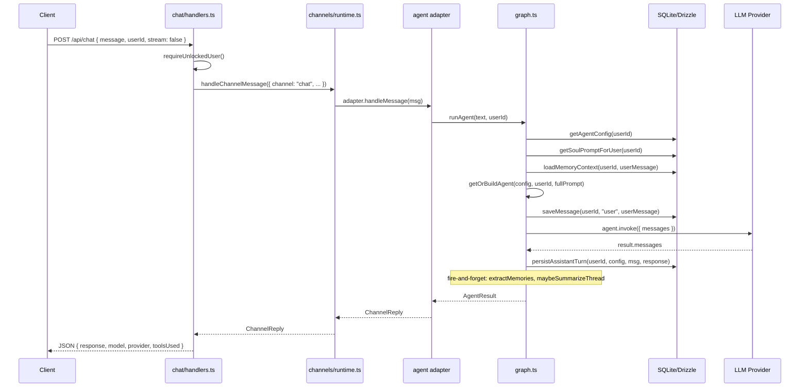
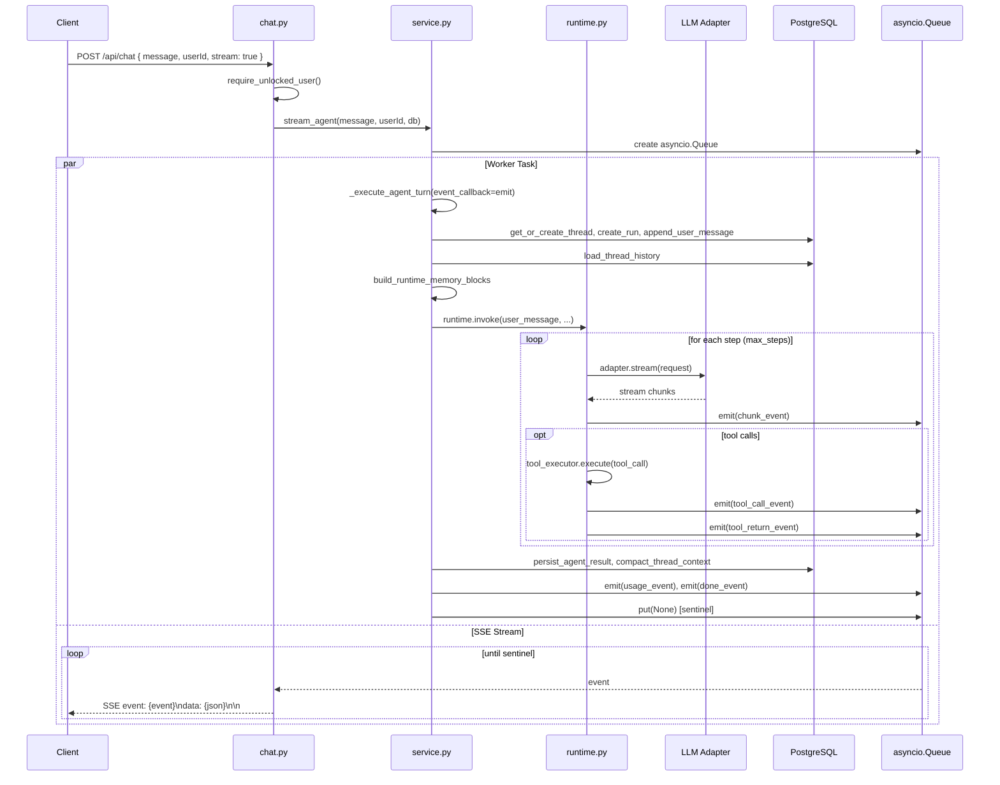
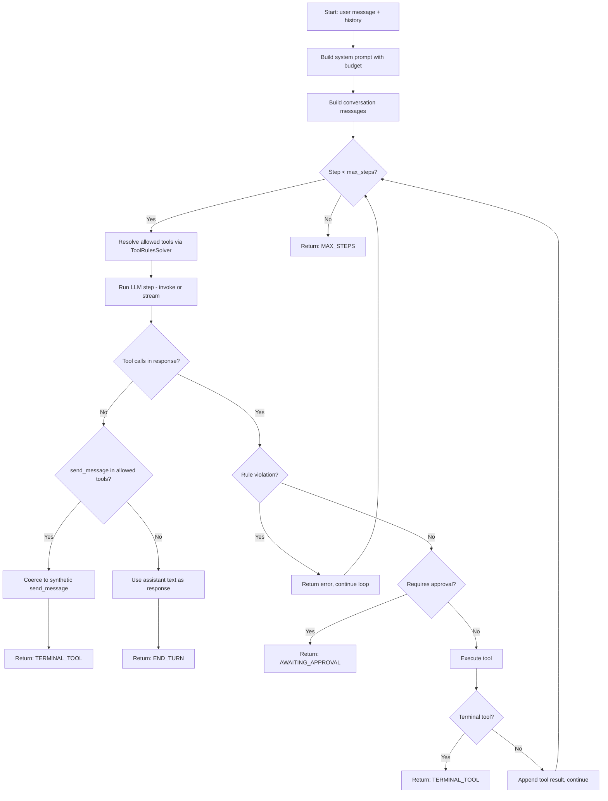

# Agent Orchestration & Chat — Architecture Audit

> **Date:** 2026-03-14
> **Scope:** Full agent/chat orchestration across `apps/api` (TypeScript/Hono legacy) and `apps/server` (Python/FastAPI primary).

---

## Table of Contents

1. [Architecture Overview](#1-architecture-overview)
2. [TypeScript Legacy API (`apps/api`)](#2-typescript-legacy-api-appsapi)
   - [Request Flow](#21-request-flow)
   - [Agent Graph (`graph.ts`)](#22-agent-graph-graphts)
   - [Channel Abstraction](#23-channel-abstraction)
   - [Checkpointing & Thread State](#24-checkpointing--thread-state)
   - [Memory Context Loading](#25-memory-context-loading)
   - [Post-Turn Hooks](#26-post-turn-hooks)
   - [Agent Caching](#27-agent-caching)
3. [Python Server (`apps/server`)](#3-python-server-appsserver)
   - [Request Flow](#31-request-flow)
   - [Agent Runtime (`runtime.py`)](#32-agent-runtime-runtimepy)
   - [Service Layer (`service.py`)](#33-service-layer-servicepy)
   - [Turn Coordination](#34-turn-coordination)
   - [Streaming Architecture](#35-streaming-architecture)
   - [Persistence Layer](#36-persistence-layer)
   - [Post-Turn Hooks](#37-post-turn-hooks)
4. [Bugs Found & Fixed](#4-bugs-found--fixed)
5. [Remaining Known Issues & Recommendations](#5-remaining-known-issues--recommendations)
6. [Sequence Diagrams](#6-sequence-diagrams)

---

## 1. Architecture Overview

AnimaOS runs two backend systems that can serve the agent chat:

| Component | Stack | Status | Location |
|-----------|-------|--------|----------|
| **Legacy API** | Bun + Hono + LangGraph + Drizzle (SQLite) | Legacy | `apps/api/` |
| **Python Server** | FastAPI + custom loop runtime + SQLAlchemy (PostgreSQL) | Primary | `apps/server/` |

Both implement the same conceptual pipeline:

```
User Message → Auth Gate → Agent Runtime → LLM Call(s) → Tool Execution → Response Persistence → SSE/JSON Response
                                ↓                              ↓
                          Memory Context               Post-Turn Hooks
                          (semantic retrieval)    (consolidation, reflection)
```

The desktop app (`apps/desktop`) connects to whichever backend is active.

---

## 2. TypeScript Legacy API (`apps/api`)

### 2.1 Request Flow

```
POST /api/chat { message, userId, stream }
  → schema validation (Zod)
  → requireUnlockedUser(c, userId)
  → if stream=false:
      handleChannelMessage({ channel: "chat", userId, text })
        → createAgentChannelAdapter("chat").handleMessage()
          → runAgent(text, userId)
  → if stream=true:
      ReadableStream + SSE
        → handleChannelStreamMessage()
          → createAgentChannelAdapter("chat").streamMessage()
            → streamAgent(text, userId)
```

**Key files:**
- `apps/api/src/routes/chat/handlers.ts` — HTTP handlers
- `apps/api/src/routes/chat/schema.ts` — Zod validation schemas
- `apps/api/src/channels/` — Channel abstraction layer
- `apps/api/src/agent/graph.ts` — Agent orchestrator

### 2.2 Agent Graph (`graph.ts`)

The orchestrator (`graph.ts`) wires together:

1. **Config resolution** — loads per-user `agent_config` from DB (provider, model, API key), falls back to local Ollama with `qwen3:14b`.
2. **Prompt assembly** — resolves the system prompt (DB custom prompt → per-user `soul.md` → built-in default), then appends memory context.
3. **Agent caching** — reuses a cached LangGraph agent if config + prompt haven't changed.
4. **Message persistence** — saves user message before invocation, assistant message after.
5. **Post-turn hooks** — fire-and-forget memory extraction + thread summarization.

**Non-streaming path (`runAgent`):**
```typescript
async function runAgent(userMessage, userId): Promise<AgentResult> {
  // 1. Resolve runtime (config + prompt + cached agent)
  // 2. Save user message to DB
  // 3. agent.invoke({ messages: [HumanMessage(userMessage)] })
  // 4. Extract AI response from result messages
  // 5. Collect tools used
  // 6. Persist assistant turn (message + fire-and-forget extraction/summarization)
  // 7. Return { response, model, provider, toolsUsed }
}
```

**Streaming path (`streamAgent`):**
```typescript
async function* streamAgent(userMessage, userId): AsyncGenerator<string> {
  // 1. Resolve runtime (includes conversationHint for semantic retrieval)
  // 2. Save user message to DB
  // 3. agent.stream({ messages: [HumanMessage(userMessage)] })
  // 4. Yield AI text chunks (filter by AIMessage + model_request node)
  // 5. Persist full response after stream completes
}
```

### 2.3 Channel Abstraction

The channel layer (`apps/api/src/channels/`) provides a pluggable adapter pattern:

```
ChannelRuntime
  ├── adapters Map<ChannelName, ChannelAdapter>
  │     ├── "chat"     → createAgentChannelAdapter("chat")
  │     ├── "telegram"  → createAgentChannelAdapter("telegram")
  │     ├── "webhook"   → createAgentChannelAdapter("webhook")
  │     └── "discord"   → createAgentChannelAdapter("discord")
  ├── handleMessage(msg)  → adapter.handleMessage(msg) → Promise<ChannelReply>
  └── streamMessage(msg)  → adapter.streamMessage(msg) → AsyncGenerator<string>
```

**Types:**
```typescript
type ChannelName = "chat" | "telegram" | "webhook" | "discord";

interface ChannelInboundMessage {
  channel: ChannelName;
  userId: number;
  text: string;
  receivedAt?: string;
  metadata?: Record<string, unknown>;
}

interface ChannelReply {
  text: string;
  model?: string;
  provider?: string;
  toolsUsed?: string[];
}

interface ChannelAdapter {
  readonly channel: ChannelName;
  handleMessage: (message: ChannelInboundMessage) => Promise<ChannelReply>;
  streamMessage?: (message: ChannelInboundMessage) => AsyncGenerator<string>;
}
```

All four channel adapters currently delegate to the same `runAgent`/`streamAgent` functions, making the adapter layer a thin routing concern.

### 2.4 Checkpointing & Thread State

**Location:** `apps/api/src/agent/checkpointer.ts`

Uses a custom `SqliteCheckpointSaver` (extends LangGraph's `BaseCheckpointSaver`) backed by Drizzle ORM tables:

- `langgraphCheckpoints` — stores checkpoint snapshots per thread
- `langgraphWrites` — stores pending writes per checkpoint

**Thread management:**
- `getOrCreateThreadId(userId)` — creates one thread per user, handles race conditions with retry
- `resetAgentPersistence(userId)` — deletes all checkpoints + writes + thread row
- Each user gets a single thread identified by `crypto.randomUUID()`

### 2.5 Memory Context Loading

**Location:** `apps/api/src/agent/context.ts`

Assembles contextual memory for the system prompt using a 4-layer approach:

1. **Essential profile data** (always loaded):
   - `user/facts` — personal details
   - `user/preferences` — likes/dislikes
   - `user/current-focus` — current focus area

2. **Recent daily logs** — today + yesterday's journal entries

3. **Tasks** — open tasks from DB (with due dates), last 3 completed tasks

4. **Semantic retrieval** (when `conversationHint` is provided):
   - Uses `retrieveContextMemories()` for vector-similarity search
   - Budget-aware: uses remaining chars from `MAX_CONTEXT_CHARS` (6000)

Total context is capped at `MAX_CONTEXT_CHARS = 6000` characters.

### 2.6 Post-Turn Hooks

After each assistant response, two fire-and-forget processes run:

1. **Memory extraction** (`extract.ts`):
   - LLM pass to extract facts, preferences, goals, relationships from the conversation
   - Deduplicates via semantic search (threshold: 0.85) or keyword-based fallback
   - Stores in markdown memory files

2. **Thread summarization** (`summarize.ts`):
   - Triggers when checkpoint messages exceed `SUMMARIZE_THRESHOLD = 40`
   - Summarizes old messages, keeps last `KEEP_RECENT_MESSAGES = 4`
   - Replaces old messages with a `[Summary of earlier conversation]` system message

### 2.7 Agent Caching

**Location:** `apps/api/src/agent/cache.ts`

Caches built LangGraph agents per user. The cache key includes:
- Provider, model, API key, Ollama URL
- A hash of the full system prompt content

Cache is invalidated explicitly via `invalidateSoulCache()` (clears all entries).

**Prompt caching** (`prompt.ts`):
- Soul prompt cached per-user in a `Map<number, string>`
- Prompt templates cached by name
- Invalidated together via `invalidateSoulPromptCache()`

---

## 3. Python Server (`apps/server`)

### 3.1 Request Flow

```
POST /api/chat { message, userId, stream }
  → Pydantic validation (ChatRequest)
  → require_unlocked_user(request, payload.userId)
  → if not stream:
      run_agent(message, userId, db)
        → _execute_agent_turn(...)
  → if stream:
      ensure_agent_ready()
      StreamingResponse(event_stream())
        → stream_agent(message, userId, db)
          → _execute_agent_turn(..., event_callback=emit)
```

**Key files:**
- `apps/server/src/anima_server/api/routes/chat.py` — HTTP handlers
- `apps/server/src/anima_server/services/agent/service.py` — service layer
- `apps/server/src/anima_server/services/agent/runtime.py` — agent runtime loop
- `apps/server/src/anima_server/services/agent/streaming.py` — SSE event builders

### 3.2 Agent Runtime (`runtime.py`)

The Python runtime implements a **manual step loop** (not LangGraph):

```python
class AgentRuntime:
    async def invoke(self, user_message, user_id, history, ...) -> AgentResult:
        # Build system prompt with budget tracking
        # Build conversation messages (history + new user message)
        # Loop up to max_steps:
        #   1. Run LLM step (invoke or stream through adapter)
        #   2. If no tool calls → check for terminal send_message coercion → break
        #   3. If tool calls → validate against rules → execute → continue
        # Return AgentResult with response, tools_used, step_traces
```

**Key features:**
- **Tool Rules Solver** — enforces which tools are allowed, required, terminal, or need approval
- **Terminal tool coercion** — if model responds with text but `send_message` is in allowed tools, wraps it as a synthetic `send_message` call
- **Step tracing** — records `StepTrace` for each step (request messages, tool calls, results, usage)
- **Prompt budget tracking** — plans and tracks token usage for system prompt + memory blocks
- **Streaming** — delegates to `adapter.stream(request)` and emits chunk events via callback

### 3.3 Service Layer (`service.py`)

The service layer orchestrates a **4-stage turn pipeline**:

```
Stage 1: _prepare_turn_context
  → Get/create thread
  → Load history
  → Create run record
  → Reserve message sequences
  → Persist user message
  → Semantic retrieval (best-effort)
  → Build memory blocks
  → Collect feedback signals (best-effort)

Stage 2: _invoke_turn_runtime
  → Set ToolContext (contextvar for tools needing DB access)
  → Get cached AgentRuntime
  → runtime.invoke(user_message, user_id, history, ...)
  → On failure: mark user message out-of-context, mark run failed

Stage 3: _persist_turn_result
  → Count result messages
  → Reserve sequences for result messages
  → persist_agent_result (steps, messages, run finalization)
  → compact_thread_context (if tokens exceed threshold)
  → db.commit()

Stage 4: _run_post_turn_hooks (background)
  → schedule_background_memory_consolidation
  → schedule_reflection
```

### 3.4 Turn Coordination

**Location:** `apps/server/src/anima_server/services/agent/turn_coordinator.py`

Uses per-user `asyncio.Lock` to serialize concurrent requests for the same user:

```python
user_lock = get_user_lock(user_id)
async with user_lock:
    return await _execute_agent_turn_locked(...)
```

This prevents race conditions in sequence allocation, thread state, and message persistence. The lock cache is LRU-bounded at 256 entries to prevent unbounded memory growth.

### 3.5 Streaming Architecture

**Location:** `apps/server/src/anima_server/services/agent/service.py` (`stream_agent`)

Uses an `asyncio.Queue` bridging pattern:

```python
async def stream_agent(user_message, user_id, db) -> AsyncGenerator[AgentStreamEvent, None]:
    queue = asyncio.Queue(maxsize=settings.agent_stream_queue_max_size)

    async def worker():
        try:
            await _execute_agent_turn(..., event_callback=emit)
        except Exception as exc:
            await queue.put(build_error_event(str(exc)))
        finally:
            await queue.put(None)  # sentinel

    worker_task = asyncio.create_task(worker())
    try:
        while True:
            event = await queue.get()
            if event is None: break
            yield event
    except (CancelledError, GeneratorExit):
        worker_task.cancel()
        ...
    finally:
        if not worker_task.done():
            worker_task.cancel()
            ...
```

**Event types:**
| Event | Data | Description |
|-------|------|-------------|
| `chunk` | `{ content }` | Text fragment from the LLM |
| `tool_call` | `{ stepIndex, id, name, arguments }` | Tool invocation started |
| `tool_return` | `{ stepIndex, callId, name, output, isError, isTerminal }` | Tool completed |
| `usage` | `{ promptTokens, completionTokens, totalTokens }` | Token usage stats |
| `done` | `{ status, stopReason, provider, model, toolsUsed }` | Turn completed |
| `error` | `{ error }` | Error occurred |

### 3.6 Persistence Layer

**Location:** `apps/server/src/anima_server/services/agent/persistence.py`

Uses SQLAlchemy ORM with these models:

- `AgentThread` — one per user, tracks `status`, `last_message_at`
- `AgentRun` — one per turn, tracks provider/model/status/tokens/error
- `AgentStep` — one per runtime step, stores request/response JSON + tool calls
- `AgentMessage` — individual messages with sequence IDs, context flags, token estimates

**Sequence allocation** (`sequencing.py`):
- Messages use monotonically increasing `sequence_id` per thread
- Reserved in batches before persisting to avoid gaps

**Compaction** (`compaction.py`):
- Triggers when in-context token count exceeds `trigger_token_limit`
- Keeps last N messages, compacts older ones into a summary message
- Summary includes earlier summaries, user/assistant/tool excerpts

### 3.7 Post-Turn Hooks

Background tasks run after each turn via the service layer:

1. **Memory consolidation** (`consolidation.py`):
   - Uses a separate DB session (via `_build_db_factory`)
   - Extracts and stores memories from the conversation

2. **Reflection** (`reflection.py`):
   - Background self-reflection and insight generation
   - Also uses a separate DB session

---

## 4. Bugs Found & Fixed (Python/FastAPI Server)

### 4.1 Unbounded Per-User Lock Cache

**File:** `apps/server/src/anima_server/services/agent/turn_coordinator.py`
**Severity:** Low
**Impact:** `_user_locks: dict[int, asyncio.Lock]` grew without bound. Over time with many users, this is a slow memory leak.

**Fix:** Replaced with an `OrderedDict` with LRU eviction at 256 entries. Eviction skips locks that are currently held to avoid breaking in-progress turns.

### 4.2 Sensitive Error Leakage in SSE Stream

**File:** `apps/server/src/anima_server/api/routes/chat.py`
**Severity:** High
**Impact:** The SSE error handler caught all exceptions and forwarded `str(exc)` to the client. This could leak sensitive internal details (file paths, database errors, API keys in error messages) to the frontend.

**Fix:** Known error types (`LLMConfigError`, `LLMInvocationError`, `PromptTemplateError`) are still forwarded. All other exceptions return a generic error message, with the original exception logged server-side via `logger.exception()`.

---

## 5. Remaining Known Issues & Recommendations

### TypeScript Legacy API (`apps/api`) — Observed Issues

> These issues were identified during the audit but are **not fixed** in this PR since the legacy API is not the primary target.

#### 5.1 Weak Agent Cache Key

**File:** `apps/api/src/agent/cache.ts` · **Severity:** Medium

The cache key uses `fullSystemPrompt.length` instead of a content hash. Two different prompts of equal length produce the same cache key, returning the wrong cached agent.

**Recommendation:** Replace `fullSystemPrompt.length` with a fast hash of the content (e.g., DJB2).

#### 5.2 Missing `conversationHint` in Non-Streaming Path

**File:** `apps/api/src/agent/graph.ts` · **Severity:** Medium

`runAgent()` calls `resolveAgentRuntime(userId)` without a `conversationHint`, while `streamAgent()` passes the user message. Non-streaming requests miss semantic memory retrieval.

**Recommendation:** Pass `userMessage` as `conversationHint` in `runAgent`.

#### 5.3 Unhandled Promise from Fire-and-Forget Memory Extraction

**File:** `apps/api/src/agent/messages.ts` · **Severity:** Low

`extractMemories()` is called without `.catch()`. If it throws synchronously, the unhandled rejection could crash the process.

**Recommendation:** Add `.catch()` to the fire-and-forget call.

#### 5.4 SSE Stream Doesn't Handle Client Disconnection

**File:** `apps/api/src/routes/chat/handlers.ts` · **Severity:** Medium

The `ReadableStream` SSE handler doesn't wrap `controller.enqueue()` or `controller.close()` in try-catch. Client disconnect causes uncaught exceptions.

**Recommendation:** Wrap stream controller operations in try-catch.

#### 5.5 Checkpoint `list()` Full Table Scan

**File:** `apps/api/src/agent/checkpointer.ts` · **Severity:** Medium

`list()` loads all checkpoint rows into memory, then filters in JS. This could cause significant memory pressure with many users/threads.

**Recommendation:** Push `threadId`, `checkpointNs`, `checkpointId` filters into the SQL WHERE clause.

#### 5.6 Unbounded In-Memory Caches

**Files:** `cache.ts`, `prompt.ts`, `brief.ts`
**Risk:** Low (single-user desktop app), Medium (if deployed as multi-user service)

The following caches grow without bound:
- `agentCache: Map<number, CachedAgent>` — one entry per user
- `cachedSoulPromptByUser: Map<number, string>` — one entry per user
- `briefCache: Map<string, { brief, timestamp }>` — one entry per user per day

**Recommendation:** For a single-user desktop app this is acceptable. If the legacy API is ever used in a multi-user server context, add LRU eviction or TTL-based cleanup.

### 5.2 `getCurrentTurnMessages` Ambiguity (TypeScript)

**File:** `apps/api/src/agent/messages.ts`
**Risk:** Low

`getCurrentTurnMessages()` matches messages by exact content comparison of the user message. If a user sends identical messages in the same conversation, the function finds the *last* match, which is correct. However, if the content is very short or common (e.g., "hi"), false matches could occur with other messages in the conversation.

**Recommendation:** Consider using message IDs or timestamps instead of content matching for more reliable turn boundary detection.

### General / Cross-Backend Issues

#### 5.7 Background DB Session Lifecycle (Python)

**File:** `apps/server/src/anima_server/services/agent/service.py`
**Risk:** Low

`_build_db_factory()` creates a `sessionmaker` from the current request's DB bind. The background tasks (consolidation, reflection) create new sessions from this factory. If these background tasks fail to close their sessions, connection pool leaks could occur.

**Recommendation:** Ensure all background tasks use context managers (`with db_factory() as session:`) for guaranteed cleanup.

#### 5.8 No Request Timeout for Non-Streaming Chat (TypeScript)

**File:** `apps/api/src/routes/chat/handlers.ts`
**Risk:** Medium

The non-streaming `handleChannelMessage()` call has no timeout. If the LLM provider hangs, the HTTP request hangs indefinitely.

**Recommendation:** Add a timeout wrapper (e.g., `Promise.race` with `setTimeout`) around the non-streaming agent invocation.

#### 5.9 Thread-Per-User Assumption

**Both backends**
**Risk:** Low

Both backends assume one thread per user. This simplifies the architecture but means:
- History clearing deletes all conversation context
- There's no multi-conversation support
- Thread compaction operates on the single thread

**Recommendation:** This is fine for the current single-user desktop app. If multi-conversation support is needed, the thread model would need to support multiple threads per user.

#### 5.10 Memory Extraction Quality Control (TypeScript)

**File:** `apps/api/src/agent/extract.ts`
**Risk:** Low

The LLM-based memory extraction has good safeguards (deduplication, category validation), but:
- The deduplication similarity threshold (0.85) may be too high, letting through near-duplicates
- There's no limit on how many items can be extracted per turn
- The extraction prompt doesn't mention the user's existing memories, so it can't avoid re-extracting known facts

**Recommendation:** Consider passing a summary of existing memories to the extraction prompt to reduce redundant extraction.

---

## 6. Sequence Diagrams

### 6.1 Non-Streaming Chat (TypeScript Legacy)



### 6.2 Streaming Chat (Python Server)



### 6.3 Agent Runtime Step Loop (Python)



---

## Appendix: File Index

### TypeScript Legacy API (`apps/api/src/`)

| File | Purpose |
|------|---------|
| `agent/index.ts` | Public exports: `runAgent`, `streamAgent`, `resetAgentThread` |
| `agent/graph.ts` | Agent orchestrator: runtime resolution, invoke, stream |
| `agent/builder.ts` | LangGraph agent factory (model + tools + middleware + checkpointer) |
| `agent/cache.ts` | Per-user agent graph cache with config+prompt hash key |
| `agent/checkpointer.ts` | Custom LangGraph checkpoint saver backed by Drizzle ORM |
| `agent/config.ts` | User agent config loader from DB |
| `agent/context.ts` | Memory context assembly (profile + logs + tasks + semantic) |
| `agent/messages.ts` | Message persistence, turn extraction, tools-used collection |
| `agent/models.ts` | LLM model factory (OpenAI, Anthropic, Ollama, OpenRouter) |
| `agent/prompt.ts` | Soul prompt loading and template rendering |
| `agent/extract.ts` | Post-turn memory extraction via LLM |
| `agent/summarize.ts` | Thread summarization when checkpoints grow large |
| `agent/consolidate.ts` | Memory file deduplication and compression |
| `agent/brief.ts` | Daily brief generation with caching |
| `agent/nudge.ts` | Deterministic nudge system (stale focus, overdue tasks, etc.) |
| `agent/tools.langchain.ts` | LangChain tool definitions |
| `channels/index.ts` | Channel runtime initialization and exports |
| `channels/runtime.ts` | Channel adapter registry and message routing |
| `channels/types.ts` | Channel type definitions |
| `channels/adapters/agent.ts` | Agent channel adapter (delegates to runAgent/streamAgent) |
| `routes/chat/index.ts` | Chat route definitions |
| `routes/chat/handlers.ts` | Chat HTTP handlers |
| `routes/chat/schema.ts` | Zod validation schemas |

### Python Server (`apps/server/src/anima_server/`)

| File | Purpose |
|------|---------|
| `services/agent/__init__.py` | Public exports from service layer |
| `services/agent/service.py` | 4-stage turn pipeline, streaming bridge, runtime caching |
| `services/agent/runtime.py` | `AgentRuntime` class: step loop, tool execution, coercion |
| `services/agent/streaming.py` | SSE event builders and usage summarization |
| `services/agent/state.py` | `AgentResult`, `StoredMessage` dataclasses |
| `services/agent/persistence.py` | Thread/run/step/message CRUD operations |
| `services/agent/turn_coordinator.py` | Per-user asyncio.Lock with LRU eviction |
| `services/agent/tool_context.py` | ContextVar-based tool context injection |
| `services/agent/executor.py` | Tool execution with error handling |
| `services/agent/compaction.py` | Thread context compaction (token-based) |
| `services/agent/memory_blocks.py` | Runtime memory block assembly |
| `services/agent/system_prompt.py` | System prompt template rendering |
| `services/agent/rules.py` | Tool rules engine (allowed, required, terminal, approval) |
| `services/agent/llm.py` | LLM client factory and configuration |
| `services/agent/consolidation.py` | Background memory consolidation |
| `services/agent/reflection.py` | Background self-reflection |
| `services/agent/embeddings.py` | Semantic search for memory retrieval |
| `api/routes/chat.py` | FastAPI chat route handlers |
