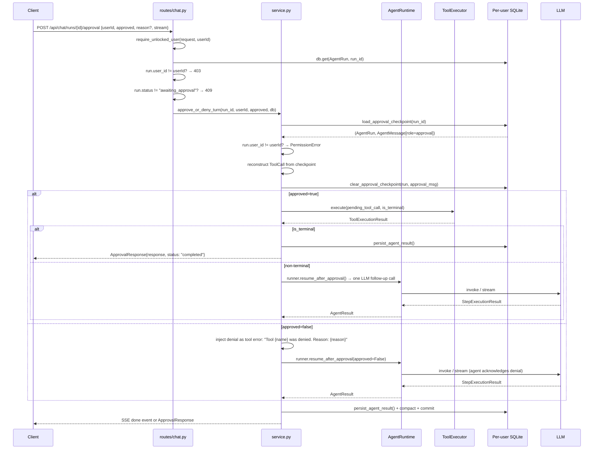
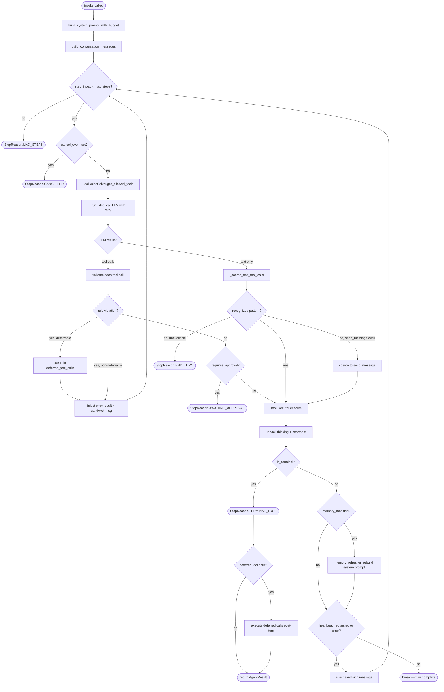

# Agent Runtime Deep Dive

[Back to Index](README.md)

This document traces a user message through the agent runtime end-to-end, explaining every layer, data structure, and decision point. It complements [Data Flow](data-flow.md) (high-level call chain) and [Services](services.md) (file-level reference) with the _why_ behind each stage.

---

## Table of Contents

1. [Architecture Overview](#architecture-overview)
2. [Layer 1: HTTP Entry Point](#layer-1-http-entry-point)
3. [Layer 2: Service Orchestrator](#layer-2-service-orchestrator)
4. [Layer 3: AnimaCompanion (Cache Layer)](#layer-3-animacompanion-cache-layer)
5. [Layer 4: AgentRuntime (Cognitive Loop)](#layer-4-agentruntime-cognitive-loop)
6. [Layer 5: LLM Adapter](#layer-5-llm-adapter)
7. [Layer 6: Tool Execution](#layer-6-tool-execution)
8. [Inner Thoughts via `thinking` Kwarg](#inner-thoughts-via-thinking-kwarg)
9. [Heartbeat-Based Loop Continuation](#heartbeat-based-loop-continuation)
10. [Tool Orchestration Rules](#tool-orchestration-rules)
11. [Context Window Management](#context-window-management)
12. [Approval Flow](#approval-flow)
13. [Cancellation](#cancellation)
14. [Post-Turn Background Work](#post-turn-background-work)
15. [Memory Correction Mechanism](#memory-correction-mechanism)
16. [Episode Merging](#episode-merging)
17. [Knowledge Graph API](#knowledge-graph-api)
18. [Error Handling & Recovery](#error-handling--recovery)
19. [Key Data Structures](#key-data-structures)
20. [Security Findings](#security-findings)

---

## Architecture Overview

The runtime follows a layered, stateless-core design:

```
HTTP Request
    |
    v
+--------------------+
|  routes/chat.py    |  FastAPI endpoint (SSE or JSON)
+--------+-----------+
         |
         v
+--------------------+
|  service.py        |  Orchestrator: locks, context assembly,
|                    |  persistence, post-turn hooks
+--------+-----------+
         |
         v
+--------------------+
|  AnimaCompanion    |  Process-resident per-user cache
|  (companion.py)    |  memory blocks, history, emotional state
+--------+-----------+
         | feeds cached state
         v
+--------------------+
|  AgentRuntime      |  STATELESS cognitive loop
|  (runtime.py)      |  prompt build -> step loop -> result
+--------+-----------+
         |
    +----+----+
    |         |
    v         v
+--------+ +--------------+
| LLM    | | ToolExecutor |
| Adapter| | (executor.py)|
+--------+ +--------------+
```

Key principle: **the runtime is stateless**. It receives history, memory blocks, and tool definitions as arguments and returns an `AgentResult`. All state management (caching, persistence, compaction) lives in the layers above it.

---

## Full Turn Flow (Mermaid)

```mermaid
sequenceDiagram
    participant C as Client
    participant R as routes/chat.py
    participant S as service.py
    participant TC as turn_coordinator.py
    participant CP as AnimaCompanion
    participant RT as AgentRuntime
    participant LLM as LLM Adapter
    participant EX as ToolExecutor
    participant DB as Per-user SQLite

    C->>R: POST /api/chat {message, userId, stream}
    R->>R: require_unlocked_user(request, userId)
    note over R: Validates x-anima-unlock token + user_id match

    alt stream=true
        R->>R: ensure_agent_ready()
        R-->>C: StreamingResponse (SSE)
        R->>S: stream_agent(message, userId, db)
        S->>S: asyncio.Queue(maxsize=256)
        S->>S: asyncio.create_task(worker)
    else stream=false
        R->>S: run_agent(message, userId, db)
    end

    S->>TC: get_user_lock(userId)
    TC-->>S: asyncio.Lock (per-user, LRU cache of 256)
    S->>S: async with user_lock (serializes concurrent turns)

    rect rgb(240, 248, 255)
        note over S: Stage 1 — Prepare Turn Context
        S->>CP: get_or_build_companion(runtime, userId)
        CP-->>S: AnimaCompanion (singleton per user)
        S->>DB: get_or_create_thread(userId)
        DB-->>S: AgentThread
        S->>CP: ensure_history_loaded(db)
        CP-->>S: list[StoredMessage] (from cache or DB)
        S->>DB: create_run(thread_id, userId, provider, model, mode)
        DB-->>S: AgentRun
        S->>DB: reserve_message_sequences(count=1)
        S->>DB: append_user_message(thread, run_id, content)
        S->>DB: hybrid_search(userId, query=message, limit=15, threshold=0.25)
        DB-->>S: semantic MemoryItems + query_embedding
        S->>DB: build_runtime_memory_blocks(userId, thread_id, semantic_results)
        DB-->>S: tuple[MemoryBlock, ...] (15+ block types)
        S->>DB: collect_feedback_signals(userId, message)
        S->>S: _inject_memory_pressure_warning() if >80% context
        S->>CP: append_to_window([user_message])
    end

    rect rgb(240, 255, 240)
        note over S: Stage 1b — Proactive Compaction (if needed)
        S->>S: estimate_tokens = (block_chars + history_chars) // 4
        alt estimated > max_tokens * trigger_ratio
            S->>DB: compact_thread_context(thread, keep_last_N)
            DB-->>S: CompactionResult
            S->>CP: invalidate_history()
            S->>CP: ensure_history_loaded(db)
        end
    end

    rect rgb(255, 248, 240)
        note over S: Stage 2 — Invoke Runtime
        S->>CP: create_cancel_event(run.id)
        S->>S: set_tool_context(ToolContext{db, userId, thread_id})
        S->>RT: runner.invoke(message, userId, history, memory_blocks, ...)

        loop for step_index in range(max_steps=6)
            RT->>RT: check cancel_event.is_set()
            RT->>RT: ToolRulesSolver.get_allowed_tools()
            RT->>LLM: adapter.invoke(LLMRequest) OR adapter.stream(LLMRequest)

            alt streaming
                loop per token
                    LLM-->>RT: StepStreamEvent{content_delta}
                    RT-->>C: SSE chunk event
                    RT->>RT: check cancel_event between chunks
                end
                LLM-->>RT: StepStreamEvent{result: StepExecutionResult}
            else blocking
                LLM-->>RT: StepExecutionResult
            end

            alt LLM returned tool calls
                RT->>RT: ToolRulesSolver.validate_tool_call()
                alt rule violation (deferrable)
                    RT->>RT: queue tool call in deferred_tool_calls
                    RT-->>RT: inject error result, continue loop
                else rule violation (non-deferrable)
                    RT-->>RT: inject error result, continue loop
                else requires_approval
                    RT-->>RT: StopReason.AWAITING_APPROVAL, break
                else normal execution
                    RT->>EX: execute(tool_call, is_terminal)
                    EX->>EX: unpack_inner_thoughts_from_kwargs(thinking)
                    EX->>EX: unpack_heartbeat_from_kwargs(request_heartbeat)
                    EX->>EX: _validate_tool_arguments()
                    EX->>EX: asyncio.wait_for(invoke_tool(), timeout=30s)
                    EX-->>RT: ToolExecutionResult{output, is_terminal, memory_modified, inner_thinking, heartbeat_requested}
                    RT-->>C: SSE tool_call + tool_return + thought events
                    alt memory_modified
                        RT->>DB: build_runtime_memory_blocks() [memory_refresher]
                        RT->>RT: rebuild system prompt, replace messages[0]
                    end
                    alt is_terminal (send_message)
                        RT-->>RT: StopReason.TERMINAL_TOOL, break
                    end
                    alt heartbeat_requested or tool error
                        RT->>RT: inject sandwich message, continue loop
                    else no heartbeat
                        RT-->>RT: break (turn complete)
                    end
                end
            else LLM returned plain text
                RT->>RT: _coerce_text_tool_calls() [regex + function tag parse]
                alt recognized tool pattern
                    RT->>EX: execute(synthetic_tool_call)
                else no pattern
                    RT->>EX: execute(send_message{message: full_text})
                end
                RT-->>RT: StopReason.TERMINAL_TOOL (or END_TURN), break
            end
        end

        note over RT: Execute deferred tool calls (if turn ended with TERMINAL_TOOL)
        RT-->>S: AgentResult{response, stop_reason, step_traces, ...}
        S->>S: clear_tool_context()
        S->>CP: clear_cancel_event(run.id)
    end

    alt stop_reason == CANCELLED
        S->>DB: cancel_run(run.id)
        S-->>C: SSE cancelled event
    else stop_reason == AWAITING_APPROVAL
        S->>DB: persist_agent_result() + save_approval_checkpoint()
        S-->>C: SSE approval_pending{runId, toolName, toolArguments}
    else success
        rect rgb(255, 240, 255)
            note over S: Stage 3 — Persist Result
            S->>DB: persist_agent_result(thread, run, result)
            S->>DB: commit()
            S->>LLM: compact_thread_context_with_llm() [best-effort LLM summary]
            S->>DB: compact_thread_context() [fallback text summary]
            S->>DB: commit()
            S->>CP: append_to_window(result_messages)
        end
        rect rgb(255, 255, 240)
            note over S: Stage 4 — Post-Turn Hooks (fire-and-forget)
            S->>DB: schedule_background_memory_consolidation()
            note over DB: regex + LLM extraction, embeddings, episodes, daily log, correction application
            S->>DB: schedule_reflection()
            note over DB: quick monologue + deep self-model reflection (delayed ~5min)
        end
        S-->>C: SSE usage + done events (or JSON ChatResponse)
    end
```



---

## Approval Resume Flow



---

## Cognitive Loop Step Detail



---

## Layer 1: HTTP Entry Point

**File**: `api/routes/chat.py`

```python
@router.post("", response_model=ChatResponse)
async def send_message(payload: ChatRequest, request: Request, db: Session):
```

Two modes:
- **`stream=false`**: Calls `run_agent()`, blocks until complete, returns `ChatResponse` with `response`, `model`, `provider`, `toolsUsed`.
- **`stream=true`**: Calls `ensure_agent_ready()` (validates LLM config), then opens an SSE stream via `stream_agent()`. Each event is formatted as `event: <type>\ndata: <json>\n\n`.

Error handling at this layer catches `LLMConfigError`, `LLMInvocationError`, and `PromptTemplateError`, returning HTTP 503.

### Other Chat Endpoints

| Endpoint | Purpose |
|----------|---------|
| `GET /api/chat/history` | Load past messages (decrypted) |
| `DELETE /api/chat/history` | Clear thread |
| `POST /api/chat/reset` | Reset thread |
| `POST /api/chat/dry-run` | Assemble full prompt without calling LLM |
| `POST /api/chat/runs/{id}/cancel` | Cancel a running turn |
| `POST /api/chat/runs/{id}/approval` | Approve/deny a pending tool call |
| `GET /api/chat/brief` | Static context brief (no LLM) |
| `GET /api/chat/greeting` | LLM-generated personalized greeting |
| `POST /api/chat/consolidate` | Trigger memory consolidation |
| `POST /api/chat/sleep` | Trigger sleep-time maintenance |
| `POST /api/chat/reflect` | Trigger deep inner monologue |

### Knowledge Graph Endpoints

| Endpoint | Purpose |
|----------|---------|
| `GET /api/graph/{userId}/overview` | Graph statistics (entity/relation counts) |
| `GET /api/graph/{userId}/entities` | List entities with mention counts |
| `GET /api/graph/{userId}/entities/{id}` | Entity detail with relations |
| `GET /api/graph/{userId}/relations` | List relations with mention counts |
| `GET /api/graph/{userId}/search` | Search entities by name |
| `GET /api/graph/{userId}/paths` | Find paths between two entities |

---

## Layer 2: Service Orchestrator

**File**: `services/agent/service.py`

This is the largest file in the runtime (~1100 lines). It manages the full turn lifecycle in four stages.

### Turn Entry: `run_agent()` / `stream_agent()`

Both delegate to `_execute_agent_turn()`, which acquires a **per-user async lock** (via `turn_coordinator.py`) to serialize concurrent requests for the same user. This prevents race conditions in conversation history and memory state.

```python
async def _execute_agent_turn(user_message, user_id, db, *, event_callback=None):
    user_lock = get_user_lock(user_id)
    async with user_lock:
        return await _execute_agent_turn_locked(...)
```

### Stage 1: Prepare Turn Context (`_prepare_turn_context`)

This is the most complex preparation stage. It assembles everything the runtime needs:

1. **Get AnimaCompanion** -- `_get_companion(user_id)` returns the cached companion or creates one
2. **Get/create thread** -- `persistence.get_or_create_thread(db, user_id)` ensures a DB thread exists
3. **Load history** -- `companion.ensure_history_loaded(db)` returns cached conversation window or loads from DB
4. **Create run record** -- `persistence.create_run()` writes an `AgentRun` row (status, provider, model, mode)
5. **Reserve sequences** -- `sequencing.reserve_message_sequences()` allocates monotonic message IDs
6. **Persist user message** -- `persistence.append_user_message()` writes to `agent_messages`
7. **Semantic retrieval** -- `embeddings.hybrid_search()`:
   - Embeds the user message
   - Cosine similarity search against stored `MemoryItem.embedding_json`
   - Similarity threshold 0.25, limit 15 results
   - `adaptive_filter()` further ranks/filters results
8. **Build memory blocks** -- `memory_blocks.build_runtime_memory_blocks()` assembles 15+ block types:
   - Soul biography, persona, human core, user directive
   - Self-model (5 sections: identity, values, inner_state, working_memory, growth_log)
   - Emotional context
   - Semantic results (query-dependent)
   - Facts, preferences, goals, tasks, relationships
   - Current focus, thread summary, episodes, session notes
9. **Feedback signals** -- `feedback_signals.collect_feedback_signals()` detects re-asks and corrections
10. **Memory pressure warning** -- injects a warning block if estimated tokens exceed 80% of context window
11. **Update companion window** -- appends user message to conversation cache

Returns a `_TurnContext(history, conversation_turn_count, memory_blocks)`.

### Stage 1b: Proactive Compaction (`_proactive_compact_if_needed`)

Before calling the LLM, estimates total context tokens:

```python
estimated_tokens = (block_chars + history_chars) // 4
```

If over `agent_max_tokens * agent_compaction_trigger_ratio`, runs `compact_thread_context()` to summarize older messages _before_ the first LLM call. This prevents oversized prompts from being rejected by the provider.

### Stage 2: Invoke Runtime (`_invoke_turn_runtime`)

1. Sets `ToolContext` (contextvar) so tools can access `db`, `user_id`, `thread_id`
2. Creates a **memory refresher callback** for inter-step memory updates
3. Calls `runner.invoke()` on the `AgentRuntime`
4. On context overflow: runs `_emergency_compact()` (aggressive settings: keep fewer messages, no reserved tokens) and retries once
5. On failure: marks run failed, removes orphaned user message from active context
6. Always clears `ToolContext` in `finally` block

### Stage 3: Persist Result (`_persist_turn_result`)

1. Counts result messages, reserves sequence IDs
2. `persist_agent_result()` writes assistant + tool messages to `agent_messages`
3. Commits to DB
4. Tries LLM-powered compaction (richer summaries) -- best-effort
5. Falls back to fast text-based compaction
6. Commits again

### Stage 4: Post-Turn Hooks (`_run_post_turn_hooks`)

Schedules two fire-and-forget background tasks:
- **Memory consolidation** -- extracts facts, preferences, emotions from the conversation; applies memory corrections; batch conflict resolution; episode creation with topic-based merging
- **Reflection** -- delayed self-model update and inner monologue

Inner thoughts extracted from the agent's `thinking` kwargs are prepended to the consolidation input so the extraction pipeline can learn from the agent's own reasoning:

```python
inner_thoughts = _extract_inner_thoughts(result)
enriched_response = (
    f"[Agent's inner reasoning]\n{inner_thoughts}\n\n"
    f"[Agent's response to user]\n{result.response}"
)
```

The `_extract_inner_thoughts()` function reads from `ToolExecutionResult.inner_thinking` (primary) with a fallback to `tool_call.arguments["thinking"]` for synthetic tool calls.

---

## Layer 3: AnimaCompanion (Cache Layer)

**File**: `services/agent/companion.py`

The `AnimaCompanion` is a process-resident, per-user singleton that caches state between turns. The runtime is stateless; the companion feeds it cached state.

### What it caches

| Cache | Invalidation | Reload trigger |
|-------|-------------|----------------|
| Static memory blocks | Version counter (`_memory_version` vs `_cache_version`) | `ensure_memory_loaded()` when stale |
| Conversation window | Cleared on compaction or reset | `ensure_history_loaded()` when empty |
| System prompt | Cleared when memory invalidated | Rebuilt by runtime per-turn |
| Emotional state | Set by consolidation callback | N/A |

### Version-counter cache pattern

```python
def invalidate_memory(self):
    self._memory_version += 1  # bump version
    # does NOT clear _memory_cache -- in-flight turn continues
    # next cache read sees version mismatch and reloads

@property
def memory_stale(self) -> bool:
    return self._cache_version < self._memory_version
```

This design allows an in-flight turn to complete with its starting data while ensuring the _next_ turn picks up changes.

### Conversation window trimming

The window is bounded by `agent_compaction_keep_last_messages`. When it overflows, `_trim_at_turn_boundary()` finds a safe cut point (user or assistant message, not tool) to avoid orphaning tool results from their paired assistant message.

### Lifecycle

- **`warm(db)`** -- pre-populates caches at startup or first request
- **`reset()`** -- clears everything on thread reset
- **`invalidate_memory()`** -- bumps version counter (tools call this when they modify memory)

### Singleton management

```python
_companions: dict[int, AnimaCompanion] = {}  # keyed by user_id

def get_or_build_companion(runtime, user_id) -> AnimaCompanion:
    # thread-safe with _companion_lock
```

---

## Layer 4: AgentRuntime (Cognitive Loop)

**File**: `services/agent/runtime.py`

This is the heart of the system -- a stateless step loop that runs the agent's cognitive cycle.

### Construction: `build_loop_runtime()`

```python
def build_loop_runtime() -> AgentRuntime:
    tools = get_tools()       # 15 tools (6 core + 9 extensions), with thinking + heartbeat injected
    return AgentRuntime(
        adapter=build_adapter(),          # OpenAI-compatible LLM client
        tools=tools,
        tool_rules=get_tool_rules(tools),  # only TerminalToolRule(send_message)
        tool_summaries=get_tool_summaries(tools),
        tool_executor=ToolExecutor(tools),
        max_steps=settings.agent_max_steps,  # default: 6
    )
```

The runtime is cached as a module-level singleton (`_cached_runner`) and rebuilt only when `invalidate_agent_runtime_cache()` is called.

### `invoke()` -- Main Entry Point

```python
async def invoke(self, user_message, user_id, history, *,
                 memory_blocks, event_callback, cancel_event,
                 memory_refresher) -> AgentResult:
```

**Phase 1: Prompt Assembly**
1. `build_system_prompt_with_budget(memory_blocks)`:
   - Calls `split_prompt_memory_blocks()` to extract dynamic identity and persona
   - `plan_prompt_budget()` allocates token budget across blocks
   - Renders Jinja2 templates: `system_prompt.md.j2`, `system_rules.md.j2`, `guardrails.md.j2`
   - Injects: persona, dynamic identity (from self-model), tool summaries, serialized memory blocks
2. `build_conversation_messages(history, user_message, system_prompt)`:
   - Builds the message array: `[system, ...history, user_message]`

**Phase 2: Step Loop**

```
for step_index in range(max_steps):    # default: 6
    1. Check cancellation event
    2. Snapshot messages for tracing
    3. Compute allowed tools via ToolRulesSolver
    4. Exclude tools that failed twice consecutively
    5. _run_step() -> call LLM
    6. Process response:
       a. No tool calls? -> try coercion, or end turn
       b. Has tool calls? -> validate (defer if blocked), execute, check terminal
    7. Refresh memory if tools modified it
    8. Continue only if heartbeat_requested or tool error; otherwise break
```

**Phase 2b: Deferred Tool Calls**

After the main loop, if the turn ended with `TERMINAL_TOOL`, any deferred tool calls (non-terminal tools that were blocked by rule violations during the loop) are executed. This preserves the model's intent when it calls tools out of order. Tool calls already executed during the turn are skipped.

**Phase 3: Result Construction**

Returns `AgentResult` with:
- `response` -- final text to the user
- `model`, `provider` -- which LLM was used
- `stop_reason` -- why the loop stopped (`end_turn`, `terminal_tool`, `max_steps`, `awaiting_approval`, `cancelled`, `empty_response`)
- `tools_used` -- list of tool names invoked
- `step_traces` -- detailed per-step diagnostics
- `prompt_budget` -- token allocation trace

### `_run_step()` -- Single LLM Invocation

Each step:
1. Creates a `StepContext` for timing/progression tracking
2. Builds an `LLMRequest` with messages, tools, force_tool_call flag
3. Calls `_invoke_llm_with_retry()`:
   - **Non-streaming**: `adapter.invoke(request)` wrapped in `asyncio.wait_for(timeout)`
   - **Streaming**: iterates `adapter.stream(request)`, emits chunk events, checks cancel between chunks
4. Appends assistant message to the message list
5. Returns `(StepExecutionResult, streamed_flag, StepContext)`

### Stop Reasons

| StopReason | Trigger | What happens |
|------------|---------|-------------|
| `END_TURN` | LLM returns text without tool calls | Response = assistant text |
| `TERMINAL_TOOL` | `send_message` tool executed | Response = tool output |
| `MAX_STEPS` | Loop exhausted `max_steps` | Default message returned |
| `AWAITING_APPROVAL` | Tool requires user approval | Checkpoint persisted, SSE event emitted |
| `CANCELLED` | Cancel event set | Empty response, run marked cancelled |
| `EMPTY_RESPONSE` | LLM returned empty with forced tool call | Recovery message returned |

### Text Tool Call Coercion

Smaller models sometimes emit tool calls as plain text instead of structured calls. The runtime detects and executes these patterns:

```
send_message("hello user")                 -> parsed and executed
tool_name {"key": "value"}                 -> parsed and executed
tool_name({"key": "value"})                -> parsed and executed
<function=tool_name>content</function>     -> Letta/MemGPT-style function tags
```

The `<function=name>` pattern handles Qwen 3.5 and other models that emit tool calls as XML-like tags. `_parse_function_tag_tool_calls()` handles multiple blocks, multiline content, missing closing tags, and JSON content inside tags.

If no recognized pattern is found but `send_message` is available, the entire text is coerced into a `send_message` call. This keeps the cognitive loop intact regardless of model capability.

### Sandwich Messages

When the loop continues between steps (due to heartbeat or tool error), a system-as-user message is injected to give the model context:

```python
# After tool error:
"Tool call failed (tool_name). You may retry with corrected arguments or respond to the user."

# After heartbeat:
"Heartbeat received. Continue with your next tool call or send_message when ready."

# After rule violation:
"Tool rule violation — the tool was not allowed at this point. Check allowed tools and try again."
```

### Consecutive Failure Exclusion

If the same tool fails twice in a row, it is excluded from the allowed tool set for the next step (as long as there are other tools available). This prevents the model from getting stuck in a retry loop.

### Memory Refresh Between Steps

When a tool sets `memory_modified=True` (detected via `ToolContext` contextvar), the runtime calls the `memory_refresher` callback between steps:

```python
if any(tr.memory_modified for tr in tool_results):
    fresh_blocks = await memory_refresher()
    if fresh_blocks is not None:
        system_prompt = rebuild_system_prompt(fresh_blocks)
        messages[0] = make_system_message(system_prompt)  # replace system message
```

This ensures that if the agent saves a memory in step 2, its system prompt in step 3 already reflects the change.

---

## Layer 5: LLM Adapter

**File**: `services/agent/adapters/`

```
adapters/
  base.py               # BaseLLMAdapter ABC
  openai_compatible.py   # Main adapter (Ollama, OpenRouter, vLLM)
  scaffold.py            # Test/mock adapter
  __init__.py            # build_adapter() factory
```

### `BaseLLMAdapter` Interface

```python
class BaseLLMAdapter(ABC):
    provider: str
    model: str

    def prepare(self) -> None: ...           # validate config
    async def invoke(self, request: LLMRequest) -> StepExecutionResult: ...
    async def stream(self, request: LLMRequest) -> AsyncGenerator[StepStreamEvent]: ...
```

The adapter normalizes provider-specific responses into `StepExecutionResult`:
- `assistant_text` -- the model's text output
- `tool_calls` -- structured tool call requests (parsed into `ToolCall` dataclass)
- `usage` -- token usage statistics
- `reasoning_content` / `reasoning_signature` -- extended thinking (if supported)
- `ttft_ms` -- time-to-first-token metric (streaming only)

### Empty Response Recovery

When models (e.g. Qwen 3.5 via Ollama) receive `tool_choice="required"` but return a completely empty response (zero text, zero tool calls), the adapter implements a three-tier fallback:

1. Retry with `tool_choice="auto"` (relaxes the constraint)
2. Retry without tools entirely (lets the model respond freely)
3. Return the empty result for the runtime to handle via `EMPTY_RESPONSE` stop reason

### Retry Logic

`_invoke_llm_with_retry()` implements exponential backoff for transient errors:

| Error type | Retryable? |
|-----------|-----------|
| Timeout (`asyncio.TimeoutError`) | Yes |
| Rate limit (429) | Yes |
| Server errors (500, 502, 503, 504) | Yes |
| Context overflow (`ContextWindowOverflowError`) | No |
| Config errors | No |
| Already streamed content | No (would cause duplicate output) |

Retry limit and backoff are configurable via `agent_llm_retry_limit`, `agent_llm_retry_backoff_factor`, `agent_llm_retry_max_delay`.

---

## Layer 6: Tool Execution

**File**: `services/agent/executor.py`

### `ToolExecutor`

Maintains a name-to-tool registry. For each tool call:

1. **Lookup** -- find tool by name, return error if unknown
2. **Unpack injected kwargs** -- `unpack_inner_thoughts_from_kwargs()` pops the `thinking` arg (stored in result), `unpack_heartbeat_from_kwargs()` pops `request_heartbeat` (stored in result)
3. **Parse check** -- if `tool_call.parse_error` is set (malformed JSON from LLM), return error without executing; `thinking` is redacted from raw_arguments
4. **Argument validation** -- `_validate_tool_arguments()` checks that required parameters (excluding `thinking` and `request_heartbeat`) are present
5. **Invoke** with timeout (`agent_tool_timeout`):
   - `ainvoke(payload)` if async
   - `invoke(payload)` if sync (LangChain-style)
   - `tool(**arguments)` via `run_in_executor` for plain functions (runs in thread pool with `contextvars.copy_context()`)
6. **Memory flag check** -- reads `ToolContext.memory_modified` after execution
7. **Return** `ToolExecutionResult` with output, error flag, terminal flag, memory_modified flag, inner_thinking, heartbeat_requested

### ToolContext (contextvar)

```python
@dataclass
class ToolContext:
    db: Session
    user_id: int
    thread_id: int
    memory_modified: bool = False  # set by tools that change memory
```

Set before the runtime loop, cleared in `finally`. Tools access it via `get_tool_context()`. When a tool modifies memory, it sets `ctx.memory_modified = True`, which triggers the memory refresh callback between steps.

### Parallel Execution

`execute_parallel()` runs multiple independent tool calls concurrently via `asyncio.gather()`. Currently not used in the main loop (tools execute sequentially per step) but available for future use.

---

## Inner Thoughts via `thinking` Kwarg

The agent's private reasoning is implemented through an injected `thinking` parameter on every tool schema, rather than a separate `inner_thought` tool. This is a Letta-style approach where the model must reason with every action.

### How it works

1. **Schema injection** (`tools.py`): `inject_inner_thoughts_into_tools()` deep-copies each tool's schema and prepends a required `thinking` string parameter:
   ```python
   {"type": "string", "description": "Deep inner monologue, private to you only. Use this to reason about the current situation."}
   ```

2. **Executor stripping** (`executor.py`): Before invoking any tool, `unpack_inner_thoughts_from_kwargs()` pops the `thinking` key from the arguments dict. The tool function never sees this parameter.

3. **Result propagation**: The extracted thought is stored in `ToolExecutionResult.inner_thinking` and flows through the system:
   - Emitted as an SSE `thought` event to the client
   - Included in `StepTrace.tool_results` for diagnostics
   - Extracted by `_extract_inner_thoughts()` in the service layer and prepended to the consolidation input

4. **System prompt instruction** (`system_prompt.md.j2`):
   ```
   Cognitive Loop:
   Every turn follows this pattern — no exceptions:
   1. ACT: Call tools as needed — every tool call includes a `thinking` argument with your private reasoning.
   2. RESPOND: Call send_message with your final reply to the user (include `thinking` with your reasoning).
   ```

5. **Privacy**: The `thinking` content is redacted from client-facing SSE events (tool_call arguments) and raw_arguments strings via `_redact_injected_kwargs_from_raw()` in `streaming.py`.

### Why not a separate `inner_thought` tool?

The `thinking` kwarg approach eliminates the need for `InitToolRule` enforcement and reduces the step count per turn. Previously the model was required to call `inner_thought` first (3-step: THINK→ACT→RESPOND), now it reasons inline with every action (2-step: ACT-with-thinking→RESPOND).

---

## Heartbeat-Based Loop Continuation

The agent's loop continuation is controlled by an optional `request_heartbeat` boolean parameter injected into all non-terminal tool schemas.

### How it works

1. **Schema injection** (`tools.py`): `inject_heartbeat_into_tools()` appends an optional `request_heartbeat` boolean to every non-terminal tool (excluded from `send_message`):
   ```python
   {"type": "boolean", "description": "Request an immediate follow-up step after this tool executes..."}
   ```

2. **Executor stripping** (`executor.py`): `unpack_heartbeat_from_kwargs()` pops the value before dispatch. Handles stringified booleans (`"true"`, `"True"`) that some models produce.

3. **Loop decision** (`runtime.py`): After executing a non-terminal tool, the loop continues **only if**:
   - `heartbeat_requested=True` on any tool result, OR
   - A tool error occurred (giving the model a chance to recover)

   If neither condition is met, the loop breaks -- the model is done with non-terminal tools.

4. **`continue_reasoning` tool**: Still available as an explicit tool the model can call when it needs another step without performing any other action. Returns a static message and the loop continues.

---

## Tool Orchestration Rules

**File**: `services/agent/rules.py`

The `ToolRulesSolver` enforces Letta-style orchestration rules that control tool availability and sequencing within a turn.

### Rule Types

| Rule | Effect |
|------|--------|
| `InitToolRule(tool_name)` | Tool must be called first in the turn. Only init tools are available at step 0. |
| `TerminalToolRule(tool_name)` | Tool ends the turn when executed (e.g., `send_message`). |
| `ChildToolRule(tool_name, children)` | After calling this tool, only the listed children are available next. |
| `PrerequisiteToolRule(prerequisite, dependent)` | Dependent tool is unavailable until prerequisite has been called. |
| `RequiresApprovalToolRule(tool_name)` | Tool call pauses the turn and waits for user approval. |
| `ConditionalToolRule(tool_name, output_mapping)` | Routes to different child tools based on the tool's output value. |

### Default Rules (from `build_default_tool_rules`)

The default configuration is minimal:

```python
def build_default_tool_rules(tool_names):
    rules = []
    if "send_message" in normalized_tools:
        rules.append(TerminalToolRule(tool_name="send_message"))
    return tuple(rules)
```

Only `send_message` is terminal. There is **no `InitToolRule`** -- the model is free to call any tool at step 0. The `thinking` kwarg on every tool replaces the old `inner_thought` InitToolRule-enforced pattern.

### Deferred Tool Calls

When a tool call is blocked by a rule violation (e.g., calling a non-init tool at step 0 when init rules exist), the tool call is deferred rather than permanently lost -- **if** the tool is:
- Not terminal (not `send_message`)
- Not an init tool (would bypass sequencing)
- Registered in the tool registry

Deferred calls execute after the main loop completes, only on `TERMINAL_TOOL` stop reason. On abnormal exits (`MAX_STEPS`, `CANCELLED`, `EMPTY_RESPONSE`) they are logged and skipped. Tool calls already executed during the turn are deduplicated.

### Force Tool Call

When `force_tool_call=True`, the LLM is instructed to always return a tool call (never plain text). This is active when `send_message` is in the allowed tools, ensuring the agent uses the structured `send_message` tool rather than emitting raw text.

---

## Context Window Management

The system uses a three-tier compaction strategy to prevent context overflow:

### Tier 1: Proactive Compaction (Pre-Turn)

**When**: Before the first LLM call, if estimated context exceeds `agent_max_tokens * agent_compaction_trigger_ratio`.

**How**: `compact_thread_context()` summarizes older messages into a thread summary, marks them `is_in_context=False`, and keeps the `agent_compaction_keep_last_messages` most recent messages.

### Tier 2: Emergency Compaction (Mid-Turn)

**When**: The LLM returns a `ContextWindowOverflowError`.

**How**: `_emergency_compact()` uses aggressive settings (keep half the normal messages, no reserved tokens) and retries the LLM call once.

### Tier 3: Post-Turn Compaction

**When**: After every successful turn.

**How**: First tries `compact_thread_context_with_llm()` (LLM-powered summarization for richer summaries), falls back to `compact_thread_context()` (fast text-based).

### Memory Pressure Warning

At 80% of context capacity, a `memory_pressure_warning` block is injected into the system prompt:

> "Your conversation context is getting full. Consider using save_to_memory to persist important facts..."

This fires only once per pressure window (resets after compaction).

### Token Estimation

All estimates use the heuristic `len(text) // 4` (approximately 4 characters per token). The `PromptBudgetTrace` tracks exact allocations:
- System prompt tokens
- Dynamic identity tokens
- Per-block token counts
- Conversation history tokens

---

## Approval Flow

Some tools can require user approval before execution (configured via `RequiresApprovalToolRule`).

### Flow

```
1. Agent requests tool call
2. ToolRulesSolver.requires_approval(tool_name) -> True
3. Runtime injects error: "Approval required before running tool: {name}"
4. Runtime stops with StopReason.AWAITING_APPROVAL
5. service.py persists an approval checkpoint:
   - The step traces so far
   - The pending ToolCall (name, id, arguments)
   - Run status set to "awaiting_approval"
6. SSE event: approval_pending {runId, toolName, toolCallId, toolArguments}
7. Client shows approval UI
```

### Resume

```
POST /api/chat/runs/{id}/approval  {approved: true/false, reason?: string}

If approved:
  -> ToolExecutor.execute(pending_tool_call)
  -> If terminal: return result immediately
  -> If non-terminal: one follow-up LLM call for response

If denied:
  -> Inject tool error: "Tool {name} was denied by user. Reason: {reason}"
  -> One follow-up LLM call so agent can acknowledge
```

Approval checkpoints are persisted as a `role='approval'` message in `agent_messages`, allowing recovery across server restarts.

---

## Cancellation

### How it works

1. `POST /api/chat/runs/{id}/cancel` calls `cancel_agent_run()`
2. Sets `asyncio.Event` on the companion: `companion.set_cancel(run_id)`
3. The runtime checks `cancel_event.is_set()` at:
   - **Step boundaries** -- between loop iterations
   - **During streaming** -- between chunks from the LLM
4. When detected, the loop breaks with `StopReason.CANCELLED`
5. The run is marked cancelled in the DB

### Mid-stream cancellation

If the cancel event fires while streaming LLM output, `_CancelledDuringStream` is raised internally, which breaks out of the stream loop cleanly.

---

## Post-Turn Background Work

**File**: `services/agent/service.py`

After every successful turn, two background tasks are scheduled (fire-and-forget, using separate DB sessions):

### Memory Consolidation (`consolidation.py`)

Runs immediately in a background task:
1. **Regex extraction** -- pattern-based extraction of facts, preferences, focus
2. **LLM extraction** -- sends conversation to LLM with `EXTRACTION_PROMPT` for deeper semantic understanding
3. **Emotional signal extraction** -- detects emotions from the conversation
4. **Batch conflict resolution** -- `resolve_conflict_batch()` compares new memories against multiple similar items simultaneously using `BATCH_CONFLICT_CHECK_PROMPT`, returning the specific DB id to supersede
5. **Claim upsert** -- structured claims with conflict resolution
6. **Embedding generation** -- creates vector embeddings for new memory items
7. **Episode creation** -- stores episodic memory with topic-based merging (see [Episode Merging](#episode-merging))
8. **Daily log** -- records the turn in `memory_daily_logs`
9. **Correction application** -- if the turn contained a correction signal, `apply_memory_correction()` searches for and supersedes contradicted memories (see [Memory Correction Mechanism](#memory-correction-mechanism))

Inner thoughts from the agent's `thinking` kwargs are included in the consolidation input, so the extraction pipeline can learn from the agent's own reasoning.

### Reflection (`reflection.py`)

Scheduled with a delay (typically 5 minutes):
1. **Quick inner monologue** -- brief self-reflection
2. **Deep monologue** -- full self-model reflection updating identity, inner state, working memory
3. **Self-model updates** -- persisted to `self_model_blocks` table

### Sleep Agent DB Lock Fix (`sleep_agent.py`)

Background sleep tasks (reflection, daily summary, self-model cleanup) use separate DB sessions for each phase to prevent lock contention:
- **Create** task record → commit → close session
- **Mark running** → commit → close session
- **Execute** LLM task (no open DB connection during LLM call)
- **Finalize** results → commit with retry → close session

`_commit_with_retry()` implements async exponential backoff (1s, 2s, 4s) to handle transient SQLite lock errors. Tasks run sequentially (not parallel `asyncio.gather`) to further reduce contention.

---

## Memory Correction Mechanism

**File**: `services/agent/feedback_signals.py`

When a user corrects the agent ("actually, my name is X, not Y"), the system detects and applies the correction to stored memories.

### Detection: `extract_correction_facts()`

Regex-based extraction of correction facts from user messages. Patterns (ordered most-to-least specific):

| Pattern | Example |
|---------|---------|
| `actually, my X is Y` | "actually, my name is Leo" |
| `it's Y, not X` | "it's Python, not JavaScript" |
| `not X, it's Y` | "not Google, but Apple" |
| `no, that's wrong, it's Y` | "nope, that's wrong. It's 28" |
| `I said/meant X` | "I meant Tuesday, not Monday" |
| `my name/age/job is X` | "my name is Alex" (standalone after correction signal) |

Returns `CorrectionFact(right, wrong, topic, pattern_kind)`.

### Application: `apply_memory_correction()`

When a correction is detected:
1. Builds search keywords from the correction's `wrong` value, `topic`, and `right` value
2. Searches recent `MemoryItem` records for content matching those keywords
3. Supersedes the contradicted memory with the corrected fact using `supersede_memory_item()`
4. No LLM call required -- purely keyword-based matching

---

## Episode Merging

**File**: `services/agent/episodes.py`

After creating a new episode, `_try_merge_episode()` checks for recent episodes (within 7 days) with overlapping topics using Jaccard similarity.

### Merge criteria

- Episodes must share >50% topic overlap (Jaccard coefficient)
- Both episodes must have non-empty topic lists

### Merge behavior

When a merge is triggered:
- **Summaries** are concatenated (older + newer)
- **Topics** are unioned (deduplicated)
- **Significance** takes the higher value
- **Turn counts** are summed
- The newer episode is deleted; the older episode absorbs it

This prevents topic fragmentation where multiple short episodes about the same subject accumulate.

---

## Knowledge Graph API

**File**: `api/routes/graph.py`, `services/agent/knowledge_graph.py`

The knowledge graph tracks entities and relations extracted from conversations. Recent enhancements include mention counts for search relevance and REST endpoints for graph exploration.

### Endpoints

| Endpoint | Purpose |
|----------|---------|
| `GET /api/graph/{userId}/overview` | Entity/relation counts, graph stats |
| `GET /api/graph/{userId}/entities` | Paginated entity list with mention counts |
| `GET /api/graph/{userId}/entities/{id}` | Entity detail with connected relations |
| `GET /api/graph/{userId}/relations` | Paginated relation list with mention counts |
| `GET /api/graph/{userId}/search` | Full-text entity search by name |
| `GET /api/graph/{userId}/paths` | Path finding between two entities |

All endpoints require `require_unlocked_user` authentication.

---

## Error Handling & Recovery

### StepFailedError

The runtime wraps all step-level failures in `StepFailedError`, which carries:
- `cause` -- the original exception
- `progression` -- how far the step got (`START`, `LLM_REQUESTED`, `RESPONSE_RECEIVED`, `TOOLS_STARTED`, `TOOLS_COMPLETED`)
- `context` -- the `StepContext` with timing data

The service layer uses `progression` for intelligent cleanup:
- Early failures (before LLM responded): just remove orphaned user message
- Late failures (after tools ran): mark run failed with detail

### Orphaned user messages

If a turn fails after persisting the user message but before completing, the message is marked `is_in_context=False` so it doesn't replay as valid history on the next turn.

### Tool-level errors

Tool failures are caught by the executor and returned as `ToolExecutionResult(is_error=True)`, which is fed back into the conversation as a tool error message. The agent can then acknowledge the error or try a different approach. The loop continues only if `heartbeat_requested` was set or the error itself triggers continuation.

### Empty LLM Response Recovery

When the LLM returns an empty response with `force_tool_call=True`, the runtime returns `StopReason.EMPTY_RESPONSE` with a user-facing recovery message. The adapter layer attempts progressive fallbacks before reaching this point (see [Empty Response Recovery](#empty-response-recovery)).

---

## Key Data Structures

### AgentResult (`state.py`)

```python
@dataclass
class AgentResult:
    response: str                          # final text for the user
    model: str                             # LLM model used
    provider: str                          # LLM provider
    stop_reason: str                       # StopReason value
    tools_used: list[str]                  # tool names invoked
    step_traces: list[StepTrace]           # per-step diagnostics
    prompt_budget: PromptBudgetTrace | None
```

### StepTrace (`runtime_types.py`)

```python
@dataclass
class StepTrace:
    step_index: int
    llm_invoked: bool = True               # False for approval-resume tool-only steps
    request_messages: tuple[MessageSnapshot, ...]  # messages sent to LLM
    allowed_tools: tuple[str, ...]
    force_tool_call: bool
    assistant_text: str
    tool_calls: tuple[ToolCall, ...]
    tool_results: tuple[ToolExecutionResult, ...]
    usage: UsageStats | None
    timing: StepTiming | None
    reasoning_content: str | None          # extended thinking
    reasoning_signature: str | None
```

### StopReason (`runtime_types.py`)

```python
class StopReason(StrEnum):
    END_TURN = "end_turn"                  # LLM returned text, no tools
    TERMINAL_TOOL = "terminal_tool"        # send_message executed
    MAX_STEPS = "max_steps"                # loop limit hit
    AWAITING_APPROVAL = "awaiting_approval"# tool needs user approval
    CANCELLED = "cancelled"                # user cancelled
    EMPTY_RESPONSE = "empty_response"      # LLM returned empty with forced tool call
```

### StepProgression (`runtime_types.py`)

Tracks how far a step progressed before failure:

```python
class StepProgression(IntEnum):
    START = 0
    LLM_REQUESTED = 1
    RESPONSE_RECEIVED = 2
    TOOLS_STARTED = 3
    TOOLS_COMPLETED = 4
    PERSISTED = 5
    FINISHED = 6
```

### ToolCall / ToolExecutionResult

```python
@dataclass
class ToolCall:
    id: str
    name: str
    arguments: dict[str, Any]
    parse_error: str | None      # set if LLM sent malformed JSON
    raw_arguments: str | None    # original unparsed string

@dataclass
class ToolExecutionResult:
    call_id: str
    name: str
    output: str
    is_error: bool = False
    is_terminal: bool = False    # true for send_message
    memory_modified: bool = False
    inner_thinking: str | None = None      # extracted from thinking kwarg
    heartbeat_requested: bool = False      # extracted from request_heartbeat kwarg
```

---

## SSE Event Types

When streaming, the runtime emits these event types:

| Event | Payload | When |
|-------|---------|------|
| `chunk` | `{content: string}` | LLM text token received |
| `reasoning` | `{stepIndex, content, signature?}` | Extended thinking content |
| `thought` | `{stepIndex, content}` | Agent's inner thinking (from `thinking` kwarg) |
| `step_state` | `{stepIndex, phase: "request"\|"result", ...}` | Step lifecycle: request details or result summary |
| `warning` | `{stepIndex, code, message}` | Non-fatal issue (e.g., `empty_step_result`) |
| `tool_call` | `{stepIndex, name, id, arguments}` | LLM requests a tool call (`thinking` and `request_heartbeat` redacted) |
| `tool_return` | `{stepIndex, callId, name, output, isError, isTerminal}` | Tool execution completed |
| `timing` | `{stepIndex, stepDurationMs, llmDurationMs, ttftMs}` | Step timing data |
| `usage` | `{promptTokens, completionTokens, totalTokens, reasoningTokens?, cachedInputTokens?}` | Token usage summary |
| `approval_pending` | `{runId, toolName, toolCallId, arguments}` | Tool awaiting user approval |
| `cancelled` | `{runId}` | Turn was cancelled |
| `done` | `{status, stopReason, provider, model, toolsUsed}` | Turn complete |
| `error` | `{error: string}` | Unrecoverable error |

---

## File Reference

| File | Role |
|------|------|
| `service.py` | Turn orchestrator (stages 1-4) |
| `companion.py` | Per-user state cache |
| `runtime.py` | Stateless cognitive loop |
| `executor.py` | Tool call execution, thinking/heartbeat unpacking |
| `tools.py` | Tool definitions (6 core + 9 extensions), schema injection |
| `rules.py` | Tool orchestration rules |
| `system_prompt.py` | Jinja2 prompt assembly |
| `prompt_budget.py` | Token budget planning |
| `messages.py` | Message construction |
| `persistence.py` | DB read/write for threads, runs, messages |
| `sequencing.py` | Monotonic message ordering |
| `streaming.py` | SSE event construction, injected kwarg redaction |
| `runtime_types.py` | Step-level data types |
| `state.py` | `AgentResult`, `StoredMessage` |
| `tool_context.py` | ContextVar for tool DB access |
| `turn_coordinator.py` | Per-user async locks |
| `compaction.py` | Context window compaction |
| `memory_blocks.py` | Memory block assembly (15+ types) |
| `adapters/base.py` | LLM adapter ABC |
| `adapters/openai_compatible.py` | Main adapter implementation, empty response recovery |
| `consolidation.py` | Post-turn memory extraction, batch conflict resolution |
| `reflection.py` | Post-turn self-model reflection |
| `embeddings.py` | Embedding generation + hybrid search |
| `feedback_signals.py` | Re-ask/correction detection, memory correction application |
| `episodes.py` | Episodic memory with topic-based merging |
| `knowledge_graph.py` | Entity/relation extraction and graph queries |
| `sleep_agent.py` | Background maintenance tasks with session-per-phase DB pattern |

---

## Security Findings

The following issues were identified during the 2026-03-20 audit. None are critical for the local desktop threat model, but they are tracked here for completeness.

---

### [LOW] `dry-run` returns the full decrypted system prompt to the client

`POST /api/chat/dry-run` returns `systemPrompt` in the response — the fully assembled system prompt including all memory blocks (soul, persona, self-model, facts, emotions, episodes, session notes). The `thinking` parameter is stripped from tool schemas in dry-run output via `_strip_thinking_from_schema()`. The endpoint is gated by `require_unlocked_user` (same user only), so there is no cross-user exposure. However, if any future multi-user or shared-session mode were introduced, this endpoint would become a high-value target.

**Location:** `api/routes/chat.py`

---

### [LOW] LLM provider errors bubble up verbatim as SSE `error` events

`LLMConfigError` and `LLMInvocationError` are caught and stringified directly into the SSE stream:

```python
except (LLMConfigError, LLMInvocationError, PromptTemplateError) as exc:
    yield _format_sse_event("error", {"error": str(exc)})
```

These exception messages may include provider base URLs, model names, rate-limit details, or connection strings from the LLM configuration. For a local desktop app this is acceptable (the client is the owner), but it's worth noting if a web-hosted mode is ever introduced.

**Location:** `api/routes/chat.py`

---

### [LOW] Tool errors expose raw Python exception text to the client

`ToolExecutor.execute()` returns raw exception messages:

```python
output=f"Tool {tool_call.name} failed: {exc}"
```

This string is fed back into the conversation (visible to the agent) and included in `step_traces` returned by `dry-run`. Internal DB errors, file paths, or ORM messages could appear here. Error messages are truncated to 1000 characters via `_package_error_response()`.

**Location:** `executor.py`

---

### [LOW] Per-user turn lock held for full streaming duration

`_execute_agent_turn()` acquires the per-user `asyncio.Lock` for the entire turn, including during SSE streaming. A long streaming response for user X blocks any other request for user X until it completes. This is intentional for consistency, but means a second tab sending a message while the first is streaming will appear to hang.

**Location:** `service.py`, `turn_coordinator.py`

---

### [INFO] Text tool call coercion executes LLM plain-text output as tools

`_coerce_text_tool_calls()` parses plain text output like `send_message("hello")` and executes it as a real tool call. The coercion is bounded to `known_tool_names` (registered tools only), so an unrecognized tool name in the text is ignored. The `<function=name>` tag pattern adds another coercion surface. However, a jailbroken or compromised LLM that knows the tool names could produce tool calls without going through the structured call path, bypassing any future structured-call-level audit hooks.

**Location:** `runtime.py`

---

### [INFO] Background tasks (consolidation, reflection) run after logout

Post-turn background tasks (`schedule_background_memory_consolidation`, `schedule_reflection`) use a separate DB factory and access DEKs via `unlock_session_store.get_active_dek(user_id)`. These tasks continue running for their full duration even if the user logs out between turns, because `_latest_deks_by_user` retains DEKs until all sessions for that user are revoked. This is by design (data integrity), but means logout is not an instant hard stop for in-flight background work.

**Location:** `service.py`, `sessions.py`

---

### [INFO] `ToolContext` propagation across thread pool workers

Synchronous tools run in `loop.run_in_executor(None, ctx.run, _run)` with `contextvars.copy_context()`. The copy-then-propagate pattern manually reads back `memory_modified` from the thread context. This relies on checking `_current_context` directly, which is a private implementation detail. If the contextvar name ever changes this silently breaks.

**Location:** `executor.py`
