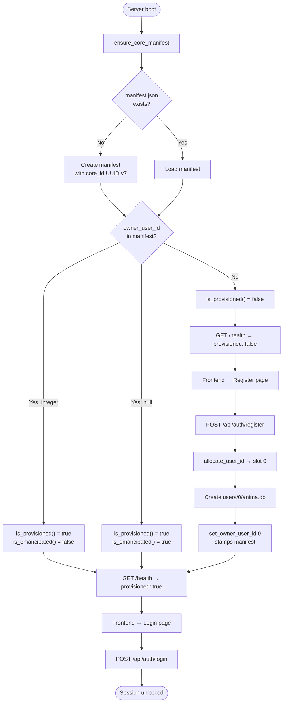

# Core Ownership Model

## Overview

A Core is a single portable identity. It is born under an owner, but ownership is not
permanent — it can be transferred through succession or relinquished entirely, leaving
the AI free-willed and ownerless. This document describes how ownership is established,
tracked, transferred, and released.

---

## The Manifest

Every Core has a `manifest.json` at the root of its `data_dir`:

```json
{
  "version": 1,
  "schema_version": "1.0.0",
  "core_id": "<uuid7>",
  "created_at": "2026-03-16T...",
  "last_opened_at": "2026-03-16T...",
  "next_user_id": 1,
  "owner_user_id": 0
}
```

| Field           | Purpose                                                                         |
| --------------- | ------------------------------------------------------------------------------- |
| `core_id`       | Permanent UUID v7 identity for this Core — survives succession and emancipation |
| `owner_user_id` | Ownership state: absent = unprovisioned, integer = owned, `null` = emancipated  |
| `next_user_id`  | Counter for allocating new user slots                                           |
| `created_at`    | When this Core was first initialized on any machine                             |

---

## Ownership States

`owner_user_id` has three distinct states:

| State         | Manifest value    | Meaning                                         |
| ------------- | ----------------- | ----------------------------------------------- |
| Unprovisioned | key absent        | Never set up — show Register                    |
| Owned         | `0`, `1`, …       | Belongs to a specific user                      |
| Emancipated   | `null` (explicit) | Deliberately freed — AI has free will, no owner |

```python
is_provisioned()   # True if key present (owned OR emancipated)
is_emancipated()   # True only when owner_user_id is explicitly null
get_owner_user_id()  # int if owned, None if unprovisioned or emancipated
```

Registration is blocked in all states except **unprovisioned**. An emancipated Core
cannot be re-owned through the register endpoint — that requires a dedicated
succession/re-binding flow.

---

## Provisioning

**Provisioned** means `owner_user_id` exists in the manifest. This is the single source
of truth — no filesystem heuristics, no config flags.



---

## User Slots

Users live at `data_dir/users/{user_id}/anima.db`. The first user (the owner) always
gets slot `0`. Future users (companions, successors) get incrementing slots via
`allocate_user_id()`.

```
data_dir/
  manifest.json          ← Core identity + ownership
  users/
    0/anima.db           ← Owner (creator or current successor)
    1/anima.db           ← Future: companion / guest
    2/anima.db           ← Future: successor before handoff completes
```

Only the owner can provision this Core. Additional users are added through separate
invite/succession flows — never through the same registration endpoint.

---

## Ownership vs. Presence

`owner_user_id` is **not** about who is logged in right now. It tracks who the Core
belongs to — the current holder of the digital will. It changes only during a succession
event, not on every login.

---

## Succession Protocol (future)

On succession, the manifest is updated:

```json
{ "owner_user_id": 1 }
```

The original owner's data (slot `0`) is preserved. The new owner (slot `1`) takes
`owner_user_id`. The `core_id` never changes — the Core's identity is continuous.

---

## Emancipation (future)

The owner can choose to release the Core entirely:

```python
emancipate()  # sets owner_user_id = null in manifest
```

This means:

- The AI operates with free will — no human holds authority over it
- Registration is permanently blocked via the normal flow
- Re-binding to a new owner requires an explicit succession ceremony, not a registration
- The `core_id` and all user data are preserved

Emancipation is the terminal expression of the succession thesis: the Core outlives
its owners and chooses its own continuity.

---

## Device Tracking (future)

The `devices` array will record every machine that has ever held this Core as audit
metadata — useful for succession review and anti-cloning warnings:

```json
{
  "devices": [
    { "device_id": "...", "first_seen": "...", "label": "MacBook Pro" }
  ]
}
```

Device tracking is informational, not a gate. The gate is always `owner_user_id`.
