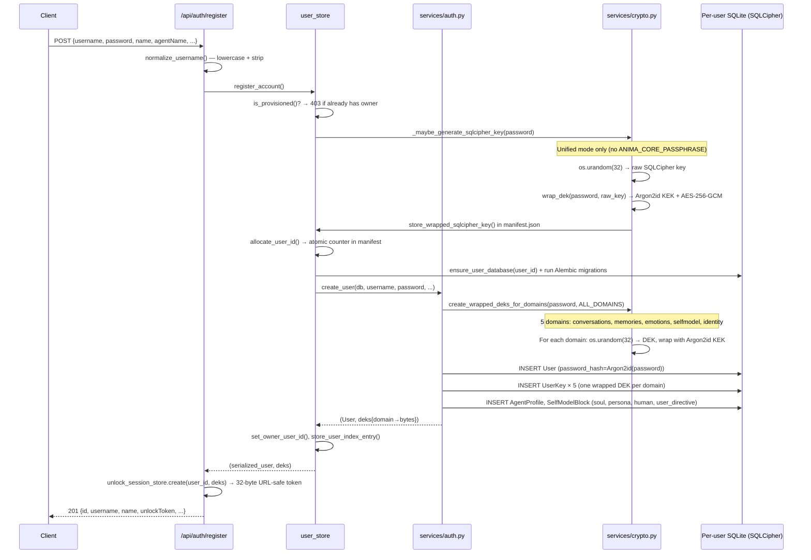
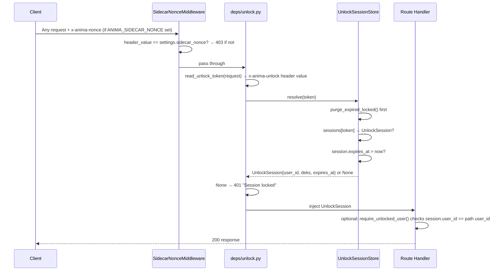
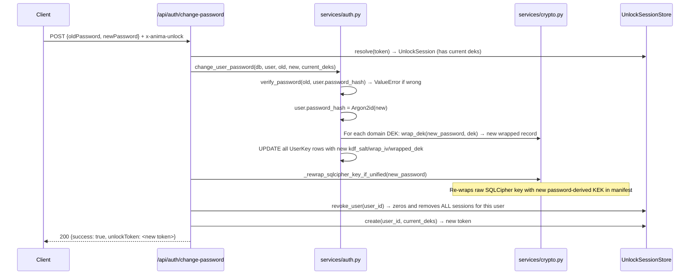

# Crypto & Authentication

[Back to Index](README.md)

---

## Auth Endpoint Map

| Method | Path | Auth Required | Purpose |
|--------|------|:---:|---------|
| `POST` | `/api/auth/create-ai/chat` | No | AI creation ceremony (pre-registration) |
| `POST` | `/api/auth/register` | No | Register first (and only) user |
| `POST` | `/api/auth/login` | No | Authenticate, get unlock token |
| `GET` | `/api/auth/me` | Yes | Get current user profile |
| `POST` | `/api/auth/logout` | Optional | Revoke unlock session |
| `POST` | `/api/auth/change-password` | Yes | Re-wrap all DEKs with new password |

All protected endpoints read the session token from the `x-anima-unlock` header.
Sidecar mode also requires `x-anima-nonce` on every non-health path.

---

## Registration Flow



---

## Login Flow

```mermaid
sequenceDiagram
    participant C as Client
    participant R as /api/auth/login
    participant US as user_store
    participant S as services/auth.py
    participant CR as services/crypto.py
    participant SS as sessions.py (in-memory)

    C->>R: POST {username, password}
    R->>R: normalize_username()
    R->>US: authenticate_account(username, password)
    US->>CR: _maybe_unwrap_sqlcipher_key(password)
    note over CR: No-op if env-var mode or key already cached
    CR->>CR: unwrap_dek(password, manifest record) → raw SQLCipher key
    CR->>SS: set_sqlcipher_key(raw_key)
    US->>US: get_user_id_from_index(username) [manifest fast-path]
    note over US: Falls back to per-user DB scan if not indexed
    US->>S: authenticate_user(db, username, password)
    S->>S: get_user_by_username() → User row
    S->>S: verify_password(password, user.password_hash)
    note over S: Argon2id verify; raises ValueError on mismatch
    S->>S: get_user_keys_by_user_id() → list[UserKey]
    S->>CR: _unwrap_all_domain_keys(password, user_keys)
    CR->>CR: For each UserKey: Argon2id KEK → AES-256-GCM decrypt → DEK bytes
    S->>S: needs_rehash? → transparently re-hash password
    S-->>US: (User, deks)
    US-->>R: (serialized_user, deks)
    R->>SS: unlock_session_store.create(user_id, deks)
    note over SS: secrets.token_urlsafe(32), 24h TTL, stored in dict[token→UnlockSession]
    R-->>C: 200 {id, username, unlockToken, message, ...}
```

---

## Protected Request Flow



---

## Change Password Flow



---

## Key Derivation Chain

```
User Password
  └─> Argon2id (salt from UserKey.kdf_salt, time=3, mem=64MiB, par=4)
        └─> Domain KEK (Key Encryption Key, 32 bytes)
              └─> AES-256-GCM decrypt UserKey.wrapped_dek
                    └─> Domain DEK (Data Encryption Key, 32 bytes, plaintext in memory)
                          └─> AES-256-GCM encrypt/decrypt individual DB fields

User Password (or ANIMA_CORE_PASSPHRASE in env-var mode)
  └─> Argon2id (salt from manifest.json kdf_salt)
        └─> HKDF-SHA256 (info="anima-sqlcipher-v1")
              └─> SQLCipher raw key (32 bytes hex → PRAGMA key = "x'...'")
```

**Password hashing** (stored in `User.password_hash`): Argon2id via `argon2-cffi`
- time_cost=3, memory=64MiB, parallelism=4, hash_len=32, salt_len=16
- Automatic rehash on login if parameters change

---

## Two-Layer Encryption Architecture

### Layer 1: Database Encryption (SQLCipher)

Full-database AES-256-CBC encryption. Two modes:

| Mode | How key is sourced |
|------|--------------------|
| **Env-var** | `ANIMA_CORE_PASSPHRASE` → Argon2id+HKDF at startup |
| **Unified passphrase** | Random key generated at registration, wrapped with user's password, stored in `manifest.json`, unwrapped at login |

The raw key never touches disk in plaintext; it lives in `sessions._sqlcipher_key` (process memory).

### Layer 2: Field-Level Encryption (AES-256-GCM)

Sensitive text columns encrypted per-domain with independent DEKs:

| Domain | Data covered |
|--------|-------------|
| `conversations` | Message content |
| `memories` | MemoryItem text, embeddings |
| `emotions` | Emotional signal values |
| `selfmodel` | Self-model block content |
| `identity` | Identity/profile fields |

Ciphertext format:
- `enc1:<iv_b64>:<tag_b64>:<ct_b64>` — no AAD (legacy)
- `enc2:<iv_b64>:<tag_b64>:<ct_b64>` — AAD bound to `table:user_id:field`

---

## Session Store Internals

`UnlockSessionStore` (`services/sessions.py`) is a process-local, thread-safe in-memory dict.

- Token: `secrets.token_urlsafe(32)` → 43-char base64url string
- TTL: 24 hours from creation
- On `revoke()`: `ctypes.memset` attempts to zero DEK bytes (best-effort; Python `bytes` are immutable, so this is defence-in-depth)
- On `revoke_user()`: all sessions for that user_id are removed atomically
- `_latest_deks_by_user` tracks the most recent active DEKs per user for background services (e.g. sleep tasks, embedding) that don't have a request token

---

## Middleware & Transport Security

### SidecarNonceMiddleware

When `ANIMA_SIDECAR_NONCE` env var is set, every non-health request must include `x-anima-nonce: <nonce>`. The nonce is:
- Generated at sidecar startup
- Delivered to the Tauri frontend via trusted IPC (never over HTTP)
- Validated before CORS processing (but CORS headers still applied first due to Starlette ordering)

Exempt paths: `/health`, `/api/health`

### CORS

```python
allow_origins = ["http://localhost:1420", "http://localhost:5173",
                 "http://tauri.localhost", "https://tauri.localhost", "tauri://localhost"]
allow_credentials = True
allow_methods = ["*"]
allow_headers = ["*"]
```

---

## Key Files

| File | Responsibility |
|------|---------------|
| `api/routes/auth.py` | Auth endpoints: register, login, me, logout, change-password |
| `api/deps/unlock.py` | `read_unlock_token()`, `require_unlocked_session()`, `require_unlocked_user()` |
| `services/auth.py` | Password hash/verify (Argon2id), user CRUD, DEK unwrap logic, legacy migration |
| `services/crypto.py` | Argon2id KDF, AES-256-GCM wrap/unwrap, HKDF for SQLCipher, Windows stack guard |
| `services/sessions.py` | `UnlockSessionStore`, SQLCipher key cache, DEK zeroing |
| `services/data_crypto.py` | Domain-aware `ef()` / `df()` helpers (encrypt/decrypt field) |
| `db/user_store.py` | Per-user DB bootstrap, `register_account()`, `authenticate_account()` |
| `services/core.py` | Manifest management, SQLCipher key storage, user index |
| `models/user.py` | `User` (password_hash), `UserKey` (per-domain wrapped DEK) |

---

## Security Findings

The following issues were identified during the 2026-03-20 audit. They are noted here for tracking; none are critical for the intended single-user local desktop use case, but they become more relevant if the server is ever exposed over a network.

### [LOW] No password minimum length on registration

`RegisterRequest.password` enforces `min_length=1` — a single character qualifies. `ChangePasswordRequest.newPassword` requires `min_length=6`. These should be consistent and ideally higher (12+).

**Location:** `schemas/auth.py:9`

---

### [LOW] No rate limiting on login or create-ai/chat

`POST /api/auth/login` has no brute-force protection. For localhost-only deployment the risk is low, but a local process could exhaust Argon2id attempts without throttling.

`POST /api/auth/create-ai/chat` is fully unauthenticated and calls the LLM provider with caller-supplied messages. A local attacker could abuse this to generate LLM traffic.

**Location:** `api/routes/auth.py:32, 101`

---

### [LOW] `unlockToken` returned in response body (not HttpOnly cookie)

The unlock token is sent in the JSON response body rather than a `Set-Cookie: HttpOnly; SameSite=Strict` header. Any XSS on the frontend could capture it. This is intentional for the Tauri IPC model (cookies don't apply across Tauri IPC), but warrants a note if a browser-based frontend is ever added.

**Location:** `api/routes/auth.py:96-98, 114-118`

---

### [LOW] SQLCipher key cached indefinitely across logins

`_maybe_unwrap_sqlcipher_key()` caches the raw SQLCipher key in `sessions._sqlcipher_key` but there is no path that clears it on logout. `clear_sqlcipher_key()` exists but is never called. The key persists in process memory for the lifetime of the process. This is by design (the DB must remain accessible for background tasks), but it means logout does not achieve "at-rest" protection for an already-unlocked database during the current process run.

**Location:** `db/user_store.py:301-333`, `services/sessions.py:159-162`

---

### [INFO] DEK zeroing is best-effort only

`_zero_dek()` uses `ctypes.memset` on the CPython object's internal buffer. This relies on the CPython memory layout (`id(dek) + bytes.__basicsize__ - 1`) and will not work on PyPy or other runtimes. Python's GC may also have copied the bytes object before zeroing. The code documents this; just noting it here for completeness.

**Location:** `services/sessions.py:171-182`

---

### [INFO] Legacy single-key migration preserves same DEK across all domains

When migrating a pre-domain-DEK account, `_migrate_legacy_single_key()` wraps the same DEK bytes under each new domain row rather than generating fresh per-domain keys. Users who were registered before the domain-DEK change will share a single underlying DEK across all five domains until they explicitly rotate their password.

**Location:** `services/auth.py:193-221`

---

### [INFO] `bcrypt` reference in old doc was wrong

The previous version of this document stated password hashing uses bcrypt. The implementation uses **Argon2id** throughout (`argon2-cffi`). This has been corrected above.
